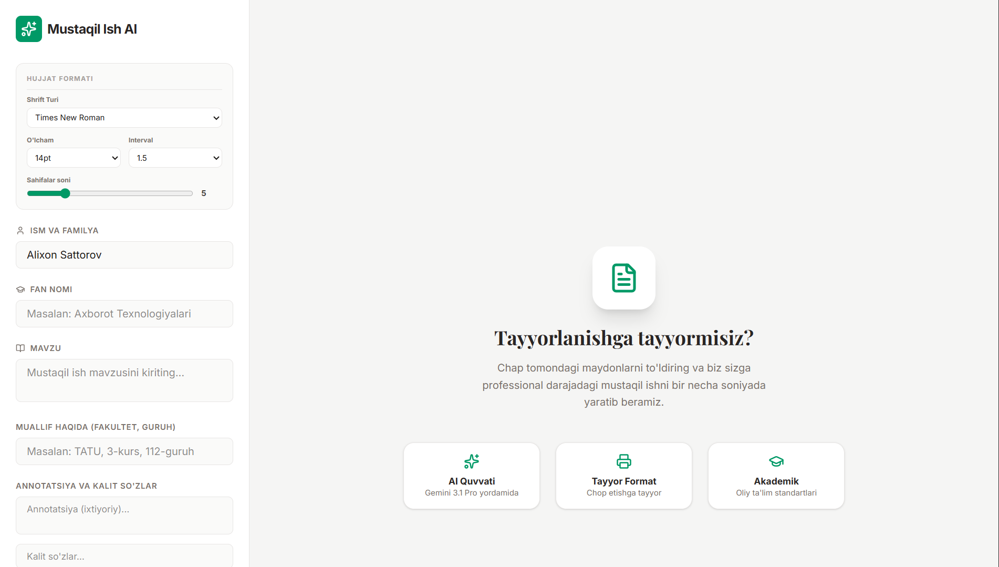

---

# 🎓 AI Mustaqil Ish Yozish Platformasi

Sun’iy intellekt asosida mustaqil ish, referat va ilmiy matnlarni avtomatik generatsiya qiluvchi platforma.
Foydalanuvchi mavzuni kiritadi va tizim akademik talabga mos, strukturali hujjatni shakllantiradi.

---

## 🚀 Demo

🔗 Demo ko‘rish: `https://mustaqil-ish-liart.vercel.app/`

📸 Platforma ko‘rinishi:

---

## 📌 Imkoniyatlar

* Mavzu asosida avtomatik mustaqil ish yozish
* Strukturali format (Kirish, Asosiy qism, Xulosa)
* Akademik uslubda matn generatsiyasi
* Sarlavha va reja tuzish
* Tayyor matnni nusxalash yoki yuklab olish

---

## 📝 Ishlash tartibi

1. Mavzuni kiriting
2. Kerakli hajm yoki talabni belgilang
3. “Generatsiya qilish” tugmasini bosing
4. Tayyor mustaqil ishni oling

---

## 🎯 Maqsad

Talabalarga vaqtni tejash va sifatli akademik matn olish imkonini berish.

---
